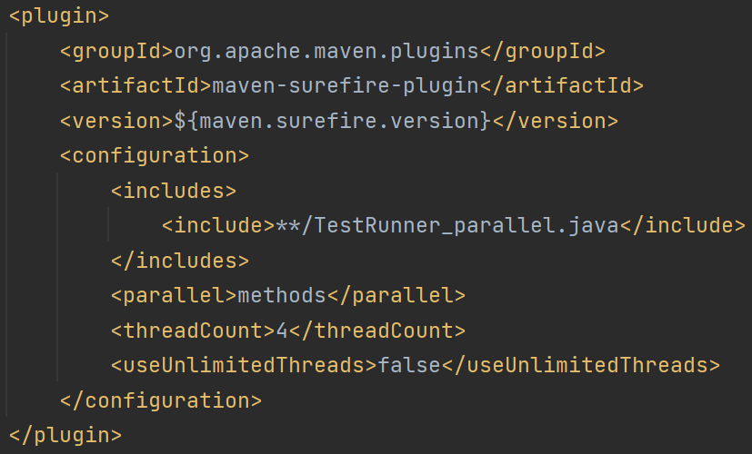
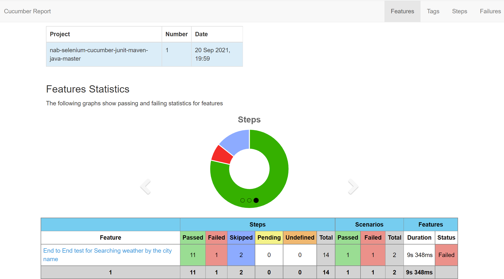
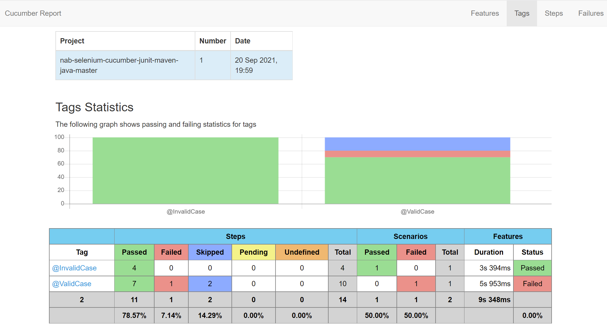
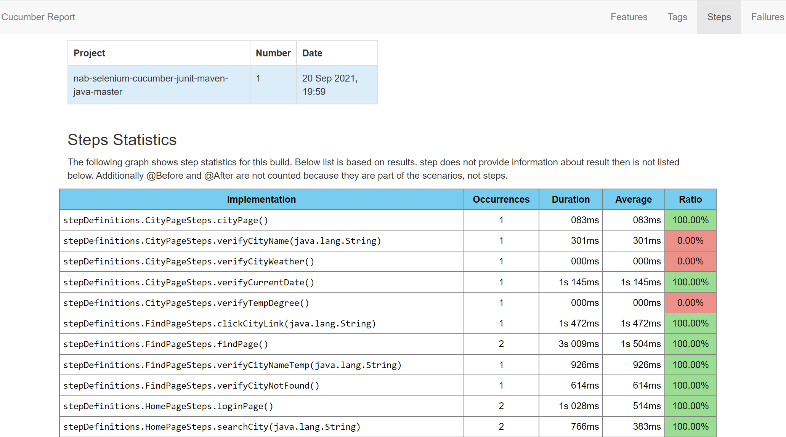
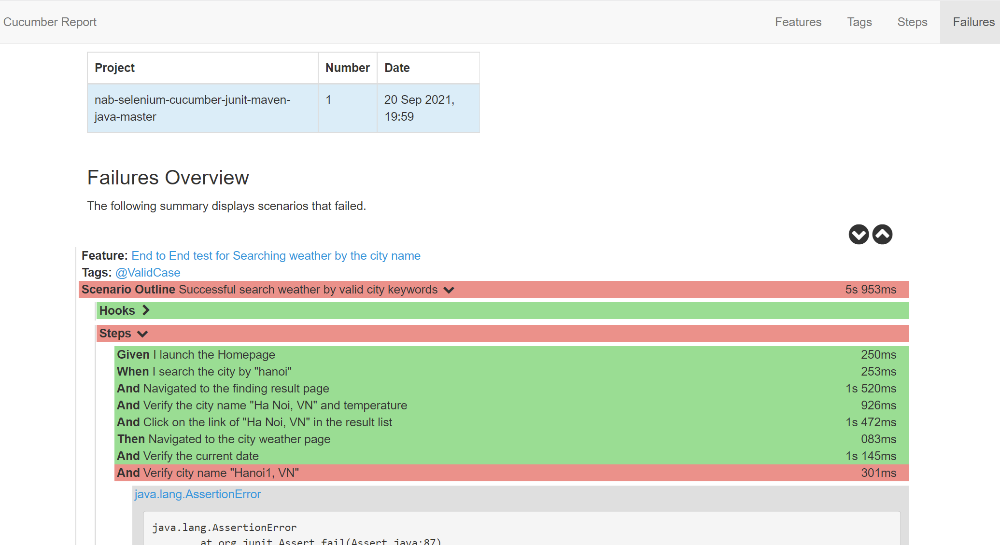

Test Automation using **Java**, **Cucumber**, **JUnit** and **Selenium Automation Test Framework**
---
---
Basic automation test framework following action and page object models, using Selenium to interact with the web browser, Cucumber to frame the tests, and JUnit to provide a standard report on the tests.

---

Framework Architecture
--------------
	Project-Name
		|_drivers
		|_src/test/java
		|	|_pageObjects
		|	|	|_HomePage.java
		|	|	|_FindPage.java
		|	|	|_CityPage.java
		|	|_stepDefinitions
		|	|	|_HomePageSteps.java
		|	|	|_FindPageSteps.java
		|	|	|_CityPageSteps.java
		|	|	|_Hooks.java
		|	|_utilities
		|	|	|_BaseClass.java
		|	|	|_DriverFactory.java
		|	|	|_PropertiesReader.java
		|	|_TestRunner.java
		|	|_TestRunner_parallel.java
		|_src/test/resources
		|	|_features
		|	|	|_SearchCity.feature
		|	|_features_parallel
		|	|	|_SearchCity1.feature
		|	|	|_SearchCity2.feature
		|	|	|_SearchCity3.feature
		|_reports
		|_config.properties
		|_pom.xml

* **drivers** - this package contains webdriver files of multi browsers on the particular platforms. The webdriver file locations are defined in src/test/java/utilities/DriverFactory.java
* **src/test/java/pageObjects** - defines the locators and methods for all Page Objectss
* **src/test/java/stepDefinitions** - you can define step defintion under this package for your feature steps.
* **src/test/java/ultilities** - defines some basic functions can be triggered on many places in Test Suite
* **src/test/java/TestRunner.java** - configure your glue code location (step defintions), define test result output format.(html, json, xml)
* **src/test/resources/features** - all the cucumber features files (files .feature ext) goes here.
* **repors** - HTML reports are separated into several directories named by running time and browser name.
* **config.properties** - user customizes the "url" and "timeout".

---

## Software Requirements

#### 1. Java Development Kit (JDK)
* [Download](https://www.oracle.com/technetwork/java/javase/downloads/index.html) and install JDK
* Setting the system variables

#### 2. Maven
* [Download](https://maven.apache.org/download.cgi) [Maven](https://maven.apache.org/) and install Maven
* Adding maven to the environment path

#### 3. Google Chrome Browser
* Install [Google Chrome](https://sites.google.com/a/chromium.org/chromedriver/) at the new build 94.x

#### 4. Firefox Browser
* Install [Firefox](https://www.mozilla.org/vi/firefox/new/) at the new build 92.x

---

## Running the tests

#### 1. Run the Test
* Suite is ready to test the feature "search weather in your city" in [openweathermap.org](https://openweathermap.org/)
* Run your test using one of the following commands from Terminal:

        mvn clean verify -DbrowserName="firefox"
        mvn clean verify -DbrowserName="chrome"

Browser choices:
* Firefox
* Chrome

Supported platforms:
* Windows
* iOS
* Ubuntu

#### 2. Single or Multi threading choice
There is a customization in the choice between running sequentially or running in parallel.
* Sequence: declare "<include>**/TestRunner.java</include>" at "maven-surefire-plugin" in pom.xml.

        "src/test/java/TestRunner.java" will be triggered.
        In "src/test/resources/features", all scenarios wil run one-by-one sequentially.

* Parallel: declare "<include>**/TestRunner_parallel.java</include>" at  "maven-surefire-plugin" in pom.xml.

        "src/test/java/TestRunner_parallel" will be triggered.
        In "src/test/resources/features_parallel", 1 feature file executes on 1 thread, all threads will be run parallelly.

    

#### 3. Test Result
* See the result inside `reports/<Date_time_browser directory>/cucumber-html-reports`
* Open "overview-features" or any html file in your browser
* Click on the site head menu to navigate to other html page
* Some sample of test results
    
    
    
    
